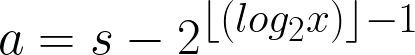
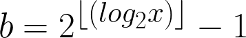
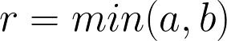

# Spell Checker

Spell Checker that uses a complete, balanced binary tree to store words and give suggestions.

A complete, balanced binary tree is achieved using this equation I developed by analyzing the relationship between the size of a sorted list and the index that would be its root in a complete balanced binary tree

x is the size of the sorted array, r is the index of the root

Using this equation, I can set the root as a pivot and recursively apply the same equation to the left and right sides of the array until there is one or zero values left in the array

[Here's an interactive desmos link for the equations](https://www.desmos.com/calculator/bqx7qgdpkf)
