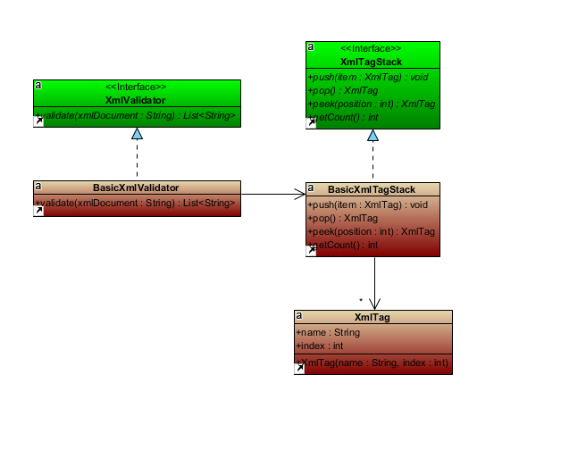

# XML Validator

Program that validates the nesting of elements in an XML document.  The nesting rule simply states that while elements may be nested, they cannot overlap. This is one of the rules that must be satisfied for an XML document to be considered well-formed.

